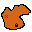

# Far West

A western themed roguelike game.
gameplay loop:
You leave your ranch and cattle behind to pick up your life as bounty hunter again.
You get thrown into a region with a `town` and a `big bounty target`:

In the town there are `shops` were you can by stuff:
- **Grocery store**: consumables for health, stamina, bonus stats etc
- **Stable**: horses
- **Gunshop**: weapons / upgrades / ammo
- **Saloon**: for recruiting extra gang members
- **clothing**: for increasing charisma

## TODO

- [X] animate player
- [X] spawn some cacti
- [X] player revolver
- [X] hitboxes
- [X] collision detection
- [X] shoot mechanics
- [ ] bullet hit animation
- [ ] environment destructable?
- [ ] enemies
- [ ] minimap
- [ ] healthbar
- [ ] dash mechanics / animation
- [ ] stamina bar
- [ ] ammunition
- [ ] reload
- [ ] town buildings
- [ ] spawn random town
