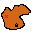

# Far West

A western themed roguelike game.
gameplay loop:
You leave your ranch and cattle behind to pick up your life as bounty hunter again.
You get thrown into a region with a `town` and a `big bounty target`:

In the town there are `shops` were you can by stuff:
- **Grocery store**: consumables for health, stamina, bonus stats etc
- **Stable**: horses
- **Gunshop**: weapons / upgrades / ammo
- **Saloon**: for recruiting extra gang members
- **clothing**: for increasing charisma

## TODO

- [X] animate player
- [X] spawn some cacti
- [X] player revolver
- [X] hitboxes
- [X] collision detection
- [X] shoot mechanics
- [ ] bullet hit animation
- [ ] environment destructable?
- [X] enemies
- [ ] interesting enemy behaviour
- [X] minimap
- [X] healthbar
- [ ] dodge mechanics / animation
- [X] dodge bar
- [X] ammunition
- [X] reload
- [X] random island world with an ocean border
- [X] level based progression with tougher enemies
- [ ] town buildings
- [ ] bandit camps
- [ ] spawn random town

## Survival run

The game is played in levels. Every level drops you on a randomly shaped
island, the ocean around it is the border of the world. You have to wipe out
every enemy to advance to the next level.

The first level starts with 6 normal enemies. Every following level the enemies
get tougher — more health, harder hitting bullets and a faster fire rate — and
there are more of them, up to a cap. When a level is cleared an overview shows
your score and time, press `N` or the `A` button to continue to the next level,
where you respawn on a fresh island with your full health back.

Killing an enemy gives you points. Running out of health ends the run on the
level you are on and pressing `Space` starts a fresh run from level 1.

## Controls

| Action | Keyboard | Gamepad |
| --- | --- | --- |
| Move | `Z`/`W`, `Q`/`A`, `S`, `D` | Left stick |
| Aim | Mouse (free angle) | Right stick (free angle) |
| Shoot | `Space` or left mouse | Right top shoulder |
| Reload | `R` | Right cluster left button (`X`) |
| Dodge | `Left Shift` | Left top shoulder |
| Switch weapon | `0` (fists), `1` (revolver) | Right top face button |
| Pause | `P` | Start |
| Continue after level | `N` | Right bottom face button (`A`) |
| Start / restart | `Space` | Start |
